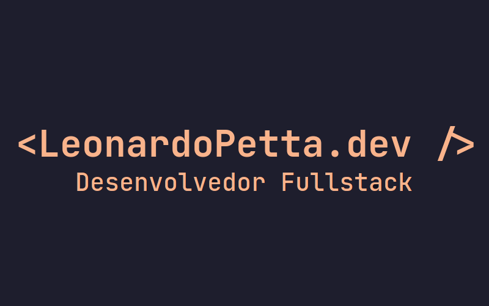

# portfolio-web

    

Meu site pessoal e blog feito com Next.js, React e Prismic como CMS.

Aqui você vai encontrar todo o código que da vida ao meu site e blog.

Sinta-se a vontade para me questionar sobre qualquer código encontrado aqui. Ficarei feliz em ajudar.

[Acessar](https://leonardopetta.dev)

## Tecnologias utilizadas

-   [Next.js](https://nextjs.org/)
-   [React](https://reactjs.org/)
-   [Prismic](https://prismic.io/)

## Autor

-   Leonardo Petta do Nascimento - [@leonardopn](https://github.com/leonardopn)

## Licença

Esse projeto está sob a licença MIT. Veja o arquivo [LICENSE](LICENSE) para mais detalhes.
